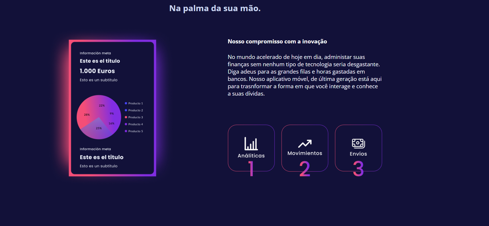
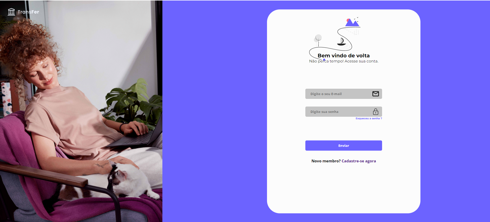

# Transfer_bank

Site de banco criado para testar e aprimorar minhas habilidades de frontend e beckend. Este repositório contém o frontend.

## Seções

* Home: Página inicial do site, contendo estastísticas e motivos para criar uma conta

* Sobre: Breve informação do conteúdo
Contato: Seção criada para possibilitar o contato do usuário com o fornecedor

* Entrar: Seção que possíbilita entrar em uma conta existente ou criar uma nova

# Demonstração do Projeto

<div class="image-container">






  <!-- Adicione mais imagens conforme necessário -->
</div>

<div class="scroll-indicator">
  Role para ver mais imagens
</div>

<style>
  .image-container {
    max-height: 300px; /* Altura máxima da seção de imagens */
    overflow-y: auto; /* Adiciona uma barra de rolagem vertical se necessário */
  }

  .image-container img {
    max-width: 100%; /* Garante que as imagens não ultrapassem a largura do contêiner */
    display: block; /* Garante que as imagens não fiquem lado a lado */
    margin-bottom: 10px; /* Espaçamento entre as imagens */
  }

  .scroll-indicator {
    margin-top: 10px; /* Espaçamento entre a seção de imagens e o indicador de rolagem */
    font-style: italic;
  }
</style>


## Tecnologias utilizadas

* React
* Css3
* Jsx
* Javascript

## Como executar o projeto?

Clone o repositório do projeto:

```bash
git clone https://github.com/JoaoHero/project_accounts2.git

Navegue até o diretório do projeto:
cd project_accounts2

Instale as dependências do projeto:
npm install

Inicie o servidor de desenvolvimento:
npm start

Abra seu navegador e acesse http://localhost:3000 para visualizar o projeto em execução.
```

## Autor

* João Ramos